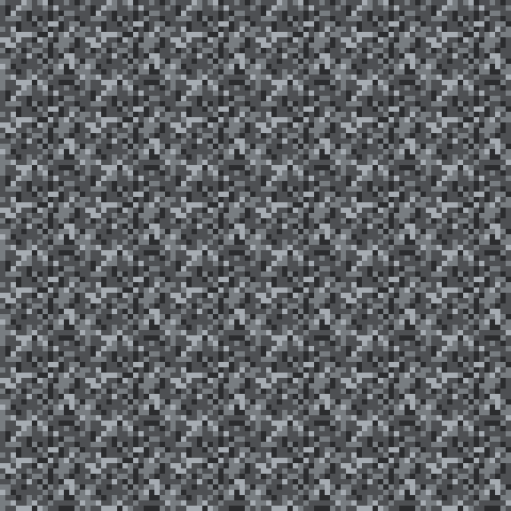
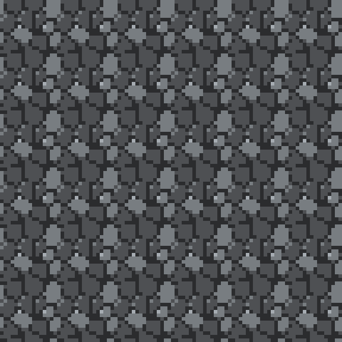

# minecraftmod

A Minecraft mod, at the foundations stage. **There is no mod yet** — there is a verified
art pipeline, a palette system, and the doctrine to build one against.

Target: **Minecraft 26.2** · **NeoForge** · **Java 21**. (Minecraft moved to year-based
versioning in 2026 — there is no `1.22`. See [`docs/PLATFORM.md`](docs/PLATFORM.md).)

---

## Start here

**[`docs/INDEX.md`](docs/INDEX.md)** — the router. Read it, then read exactly one other
thing. Every document is written to be loaded alone, so a session working on textures never
pays for the worldgen doc.

Picking up cold? **[`docs/HANDOFF.md`](docs/HANDOFF.md)** is the only file that tells you
what is *currently* true.

---

## What runs today

No dependencies. No `pip install`. Python 3 only.

```sh
python3 tools/palette_build.py                    # solve the ramps -> assets/palette.json
python3 tools/palette_check.py                    # enforce the palette law
python3 tools/demo_structure.py docs/img          # the worked example
python3 tools/texview.py <png> --tile 8 --scale 6 # the review bench
```

| Tool | Job |
|---|---|
| `colorlab.py` | sRGB ↔ CIE L\*, HSV — no colour maths anywhere else |
| `pngio.py` | dependency-free PNG read/write |
| `paintkit.py` | palette access, wrap geometry, structure index |
| `palette_build.py` | solves ramps from a base hue + target L\* per step |
| `palette_check.py` | five checks, exits non-zero — **all verified by breaking them** |
| `texview.py` | tiled / icon / greyscale review renders |
| `demo_structure.py` | hash vs structure painting, side by side |

---

## The thesis, in one picture

Same palette. Same four values. Same 16×16. Only the *placement rule* differs.

| Painted by a hash | Painted from structure |
|---|---|
|  |  |

A hash on a broad surface is **digital camouflage** — every cluster sits where a random
number put it, so no cluster means anything. Give the painter the structure and every pixel
means something. That lesson cost the [DOWNTIME](https://github.com/cadykaya/mario-3)
project a whole paint pass; see [`docs/TEXTURING.md`](docs/TEXTURING.md).

---

## The rules that constrain everything

- **`assets/palette.json` is the only source of a colour.** A literal anywhere else is a bug.
- **Adjacent values differ by ≥ 0.12 CIE L\***, enforced, no exceptions.
- **16×16, always** — mixed resolution is the loudest amateur tell in modding.
- **Paint it, don't model it.** Default hard to the plain cube.
- **Never judge a block from one tile**, or an item from anything but a 16 px icon.
- **A check that has never failed is unverified.**

---

## Prior art

The art and verification doctrine is ported from **[DOWNTIME](https://github.com/cadykaya/mario-3)**
(repo name `mario-3`), a Godot gravity platformer whose docs carry a large number of
hard-won lessons. Every rule taken from it is marked **PORTED** and every failure it
describes really happened. Rules invented here are marked **DOCTRINE**; things this project
learned itself live in [`docs/LESSONS.md`](docs/LESSONS.md) — three of them so far, and none
of them invented.

## Status

See [`docs/HANDOFF.md`](docs/HANDOFF.md). The blocking open question is **what the mod is
about** — everything built so far is deliberately subject-agnostic and survives any answer.
